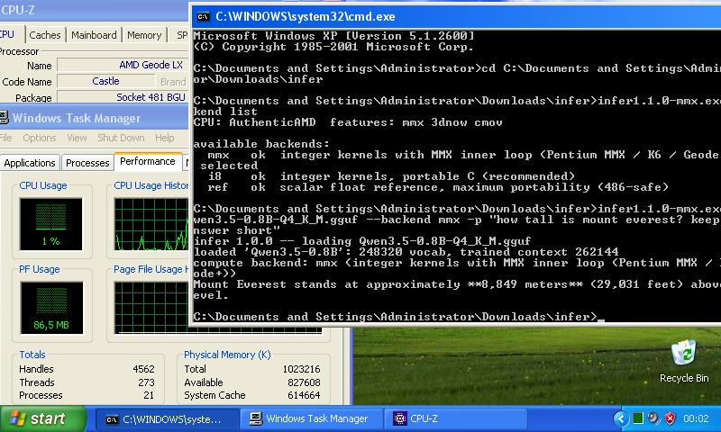

# infer

A self-contained GGUF inference server and chat client for **Qwen3.5**,
written in **ANSI C (C89)** with **no dependencies** beyond the C
standard library and the operating system's own socket calls.

CPU only. No BLAS, no `ggml`, no `libcurl`, no JSON library. The
baseline target is a **486** — and the same binary uses AVX2 on a
modern chip, decided at run time.



```
$ infer chat model.gguf
infer chat -- Qwen3.5-0.8B
context 4096 tokens, backend mmx. /help for commands, /quit to exit.

> My name is Ada.
Hello, Ada! How can I help you today?

> What is my name?
My name is **Ada**. 😊
```

---

## What it does

| | |
|---|---|
| **Runs Qwen3.5** | a hybrid architecture — 6 attention layers, 18 Gated DeltaNet layers |
| **OpenAI API** | `/v1/chat/completions` with streaming, `/v1/completions`, `/v1/models` |
| **Interactive chat** | multi-turn, with history commands |
| **Real Jinja templates** | renders the GGUF's own template, or any `.jinja` file |
| **Byte-order neutral** | bit-identical output on big-endian hosts (verified on s390x and SPARC) |
| **MCP tools** | Model Context Protocol over HTTP, in every mode |
| **One set of options** | `--system`, `--think`, `--raw`, `--mcp`, `--template` work the same in `serve`, `chat` and `run` |
| **Runs on a 486** | and on Windows XP, from the same sources |

---

## Quick start

```sh
# build
make

# get the model (508 MiB / 532 MB on disk)
curl -L -o Qwen3.5-0.8B-Q4_K_M.gguf \
  https://huggingface.co/unsloth/Qwen3.5-0.8B-GGUF/resolve/main/Qwen3.5-0.8B-Q4_K_M.gguf

# chat
./infer chat Qwen3.5-0.8B-Q4_K_M.gguf

# or serve
./infer serve Qwen3.5-0.8B-Q4_K_M.gguf
```

Nothing to `pip install`, no CMake, no submodules.

---

## Documentation

| document | what it covers |
|---|---|
| **[USER-GUIDE.md](USER-GUIDE.md)** | every command and flag, with examples |
| **[AGENTS.md](AGENTS.md)** | guidance for AI coding agents; `.agents/` has the detail |
| **[COMPILE.md](COMPILE.md)** | atomic build steps for every target and toggle |
| **[CHAT.md](CHAT.md)** | the chat REPL and MCP tools |
| **[PROFILING.md](PROFILING.md)** | `--log-perf`, `--log-stages`, and reading the output |
| **[CHANGELOG.md](CHANGELOG.md)** | what changed, and why |
| **[docs/ARCHITECTURE.md](docs/ARCHITECTURE.md)** | how the pieces fit; data flow |
| **[docs/FINDINGS.md](docs/FINDINGS.md)** | 60 surprises, each with measurements |
| **[docs/PERFORMANCE-ANALYSIS.md](docs/PERFORMANCE-ANALYSIS.md)** | why the kernels are at their hardware floor |
| **[docs/TEMPLATES.md](docs/TEMPLATES.md)** | custom Jinja templates |
| **[docs/files/](docs/files/)** | one document per source file |
| **[docs/files/opts-c.md](docs/files/opts-c.md)** | how one option table drives parsing, help and validation |
| **[docs/files/backend_avx2-c.md](docs/files/backend_avx2-c.md)** | the AVX2 kernels, and how AVX2 lives inside a 486 binary |
| **[docs/files/tpool-c.md](docs/files/tpool-c.md)** | the thread pool and its three hazards |
| **[docs/files/agent-c.md](docs/files/agent-c.md)** | shared prompt building and tool calling |

---

## Commands

```sh
infer chat  <model.gguf>    # interactive multi-turn chat
infer serve <model.gguf>    # OpenAI-compatible HTTP server
infer run   <model.gguf>    # one-shot generation
infer info  <model.gguf>    # model metadata
infer --backend list        # CPU features and available kernels
```

Options are shared between modes wherever they can be, so the same flags
mean the same thing everywhere:

```sh
infer run   model.gguf -p "What fruit?" --system "One word only."
infer serve model.gguf --system "One word only." --think
infer serve model.gguf --raw                    # for llama-bench etc.
infer chat  model.gguf -p "hello" --mcp http://127.0.0.1:3000/mcp
```

An option used where it cannot apply is reported, never silently
dropped:

```
$ infer run model.gguf --port 9090
'--port' has no effect in run mode (it applies to: serve)
```

---

## Build targets

Three targets. Everything else is a flag.

```sh
make linux              # Linux/x86    -> infer-<version>-linux
make windows            # Windows/x86  -> infer-<version>-windows.exe
make solaris            # Solaris/SPARC-> infer-<version>-solaris
make all                # all four shipping artifacts

make test               # the test suite
```

**Every accelerated kernel is compiled in and chosen at run time** after
a CPUID probe (plus `XGETBV` for AVX2). The x86 binaries carry `avx2`,
`mmx`, `i8` and `ref`; the Solaris binary carries `vis`, `i8` and
`ref`. One binary per platform: `make linux` runs on a 486 and
accelerates on anything newer.

Only `backend_avx2.c` is compiled with `-mavx2`, into its own object.
Everything else — including `qmv_i8`, `qmv_mmx` and `qmv_ref` — is
built at the i486 baseline, so the AVX2 code is present but
unreachable unless the CPU *and* the OS support it. There is no
`-sse2` or `-avx2` download to choose between, and no way to pick
wrong.

Runtime selection costs one indirect call per matrix *row* — measured at
the noise floor on both x86-64 and an i486-targeted build.

### Per-format kernels

`--backend` sets one kernel for everything. If a different kernel wins
on a particular weight format on your hardware, measure it and pin it:

```sh
infer --kernel bench -v     # time every kernel here, use the winners
infer --kernel list         # show the current assignment
infer --kernel q6k=i8       # pin one format
```

`bench` needs no model and takes a second or two.

**These kernels are not all numerically identical, so this is not a
free choice.** `i8`, `mmx` and `vis` agree bit-for-bit on every format
(`tests/t_ident.c` asserts it). `avx2` deliberately does not: since
1.20.0 it quantises the activation per 256 values instead of per 32
and reassociates the sum, which is the same mathematics in a different
order. Measured against `i8` on synthetic worst-case weights it is
bit-identical on `Q8_0` and differs on `Q4_K`/`Q5_K`/`Q6_K`. Its
accuracy is bounded against the float reference by
`tests/t_avx2acc.c`, which requires it to be at least as close to
`ref` as `i8` is.

So mixing is safe for speed among the integer kernels, and pinning
`avx2` for one format changes that format's rounding. Neither is
wrong; both are measured.

### Flags

| flag | effect |
|---|---|
| `PROFILE=1` | per-stage timers (all shipped builds have them) |
| `NATIVE=1` | `-march=native`; **only runs on the build machine** |
| `BITS=64` | 64-bit build (default 32-bit) |
| `TOOLCHAIN=gcc` | build Solaris with GCC instead of Sun Studio |
| `NO_MMX=1` `NO_AVX2=1` `NO_VIS=1` | leave a kernel out |
| `NO_THREADS=1` | compile the thread pool away entirely |
| `NO_SSE2=1` | reserved; a hand-written SSE2 kernel is not yet written |

```sh
make linux PROFILE=1            # timers
make linux BITS=64 NATIVE=1     # fastest on this machine only
make solaris TOOLCHAIN=gcc      # GCC instead of Sun Studio
```

`make all` builds the four shipping artifacts — 32-bit and 64-bit, for
Linux and Windows. All four are i486-baseline and carry every kernel.
`NATIVE=1` is excluded on purpose: it only runs on the machine that
built it.

Which backend each picks is decided at run time, by the CPU it finds:

| CPU | picks |
|---|---|
| Haswell (2013) and later, with OS `ymm` support | `avx2` |
| Pentium MMX / K6 / Geode / anything with MMX | `mmx` |
| 486 with no MMX | `i8` |
| anything, as numerical ground truth | `ref` |

One subtlety worth stating, because it looks like a contradiction:
**`i8` beats `mmx` in the 64-bit build but not the 32-bit one.** On
x86-64 the compiler may assume SSE2 and vectorises the portable `i8`
loops past the hand-written 64-bit MMX kernel, so `auto` prefers it
(finding 33). At the i486 baseline neither `__SSE2__` nor `__AVX2__`
is defined, `i8` stays scalar, and `mmx` wins. Both are correct for
their target.

The profiler stays a **compile-time** choice: its timers sit inside the
per-layer path, so a runtime test would tax every build, including the
slow machines this project exists for.

Solaris/SPARC is deliberately separate: different compiler, different
flags, big-endian, 64-bit.

Every target compiles with **zero warnings**. The i486 baseline is
audited in CI: every object except the gated `backend_avx2.o` contains
**no CMOV and no SSE/AVX**, and a `NO_AVX2=1` rebuild of the shipped
binary contains zero `xmm`/`ymm` references at all. The Windows
binaries are PE32 subsystem 4.00 and import exactly three DLLs —
KERNEL32, msvcrt, WS2_32 — all present on a stock XP install.

Full detail in [COMPILE.md](COMPILE.md).

---

## Layout

The tree is split so that porting touches as little as possible. **Only
four files know an operating system exists.**

```
src/
  main.c          launcher: dispatch, the one-shot run loop
  opts.c          the single option table: parsing, --help, validation
  agent.c         messages -> prompt, tool calls (shared by all modes)
  server.c        HTTP/1.1, SSE, the OpenAI API
  chat.c          interactive REPL
  qwen35.c        the engine: the qwen35 architecture
  tokenizer.c     byte-level BPE
  jinja.c         Jinja2 subset: values
  jinja_eval.c    Jinja2 subset: parser and interpreter
  mcp.c           MCP client over HTTP
  backend.c       CPU detection, backend selection, i8 kernels
  backend_mmx.c   MMX kernels (optional, -DINFER_HAVE_MMX)
  backend_avx2.c  AVX2 kernels -- the ONLY object built with -mavx2
  backend_a2stub.c  fallbacks when that object is not linked
  tpool.c         thread pool for row-parallel matvec (optional)
  quant.c         Q4_K/Q5_K/Q6_K/Q8_0 decoders + the float reference
  gguf.c          GGUF container reader
  sampler.c       temperature / top-k / top-p / repeat penalty
  json.c          minimal JSON parser
  prof.c          profiling and throughput logging
  util.c          allocation, growable strings, logging

  net.h           >>> the networking interface <<<
  net_posix.c       BSD sockets
  net_win32.c       Winsock 2 (XP-safe)

  sys.h           >>> file mapping and time <<<
  sys_posix.c       mmap, gettimeofday
  sys_win32.c       CreateFileMapping, QueryPerformanceCounter
```

`server.c`, `chat.c` and `mcp.c` include `net.h` and nothing else, and
are byte-for-byte identical on both platforms.

---

## The model

`Qwen3.5-0.8B` is **not a plain transformer**, which is why a generic
llama.cpp-style loop will not run it:

```
24 blocks, n_embd 1024, FFN 3584

  blocks 3,7,11,15,19,23   gated grouped-query attention
                           8 query heads, 2 KV heads, head_dim 256
                           per-head Q/K RMSNorm, interleaved mRoPE,
                           output gated by a sigmoid

  the other 18             Gated DeltaNet (linear attention)
                           128x128 recurrent state per head,
                           depthwise causal conv, L2-normalised Q/K
```

DeltaNet layers cost the same per token regardless of context length —
only the six attention layers grow.

Validated against an independent NumPy implementation written from the
reference graph: both produce identical ranked logits.

---

## Performance

Single-threaded **by default**. `--threads N` (`-T N`) splits matvec
rows across cores; `-T 0` means one per core. It stays opt-in because
a default that silently takes every core is a poor default for the
hardware this project targets. Results are bit-identical at any thread
count: rows are split, never dot products.

Threading became worth using in 1.23.0. Until then the pool paid a
44 us condition-variable round trip on each of the ~95 parallel
regions per token, which on two cores left the process at 159% CPU
instead of ~200%. It now spins briefly before blocking, and stops
spinning when asked for more threads than the machine has cores:

| threads | 1.22.0 | 1.23.0 |
|---|---|---|
| `-T 1` | 13.99 tok/s | 14.12 tok/s |
| `-T 2` | 17.25 tok/s | **22.16 tok/s** |

Generation rate, Qwen3.5-0.8B-Q4_K_M:

| machine | backend | threads | tok/s |
|---|---|---|---|
| Intel i7-9750H (user hardware) | `avx2`, 64-bit | 1 | ~12 |
| Intel i7-9750H | `avx2`, 32-bit | 1 | ~10.5 |
| Xeon @ 2.60 GHz (CI sandbox) | `avx2`, 64-bit | 1 | 14.1 |
| Xeon @ 2.60 GHz | `avx2`, 64-bit | 2 | **22.2** |
| Xeon @ 2.60 GHz | `mmx`, 32-bit | 1 | 3.2 |
| AMD Geode LX 800 @ 500 MHz | `mmx` | 1 | ~0.06 (~15.8 s/token) |

The single-core AVX2 path went 6.35 → 14.5 tok/s over 1.19–1.22 and is
**memory-bound at roughly 67% of that machine's measured 11.3 GB/s
streaming ceiling** (520 MB moves per token, so the hard ceiling is
about 21.7 tok/s on one core).
The MMX path is **instruction-bound**, using only ~14% of available
bandwidth: `Q4_K` runs at 1.19 MMX instructions per weight, and six of
its nineteen instructions per sixteen weights are `PUNPCK` widening
that exists only because `PMADDWD` takes words. MMX has no
unsigned-byte multiply-accumulate, so that is close to the floor for
Geode-class hardware.

[docs/PERFORMANCE-ANALYSIS.md](docs/PERFORMANCE-ANALYSIS.md) documents
the measurements and every rejected optimisation.

Memory: the model is `mmap`ed, so it starts instantly and the process
idles at **~44 MB RSS** (42 MB of that anonymous — the KV cache,
DeltaNet state and scratch buffers). That is the number before any
token is generated.

Generating walks every weight, so the mapped pages become resident and
peak RSS reaches **~560 MB** for the 508 MiB model. Those pages are
file-backed and clean, so the kernel can evict them under pressure
rather than swapping: the model runs on a machine with less RAM than
the file, it just pages. Anonymous memory stays ~42 MB regardless.

---

## Correctness

* **2,244 comparisons** — every tensor × 6 activation patterns × both
  fast backends against the scalar reference. Zero failures.
* **Jinja output byte-compared against Python Jinja2** — the built-in
  template and a 16 kB community template, with and without tools,
  thinking on and off. Byte-identical.
* Tokeniser round-trips CJK, emoji, accents, contractions and whitespace
  runs.
* Verified against the official OpenAI Python SDK.

`--backend ref` is always available as numerical ground truth.

---

## Licence

MIT for the code. The **model** is Apache-2.0 from Alibaba; the GGUF
conversion is by Unsloth. No weights are included here.
